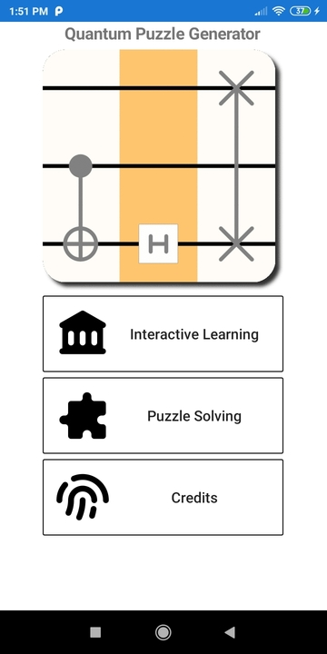

# Quantum Puzzle Generator

Quantum Puzzle Generator is a mobile puzzle game for Android and iOS. The application generates logic puzzles based on quantum computing concepts, offering a unique brain training experience.

## Project Status

This project is currently inactive and is maintained here as a portfolio piece. Previously, the application was fully published and actively available on both the Google Play Store and the Apple App Store. It was eventually delisted. The codebase remains functional and serves as a demonstration of functional programming in mobile development.

## Features

* Procedural generation of quantum logic puzzles.
* Custom game mechanics handling puzzle state and validation.
* Clean user interface optimized for mobile gameplay.
* System to save preferences between sessions.

## Tech Stack

* **Language:** F#
* **Framework:** Xamarin / Fabulous
* **UI Architecture:** Fabulous (Declarative UI framework for F#)
* **Testing:** Unit tests for validating puzzle generation and core mechanics.

## Project Structure

* **QuantumPuzzleMechanics:** Contains the core game logic, quantum rules, and the puzzle generator algorithm.
* **QuantumPuzzleTest:** Houses unit tests for the core mechanics.
* **QuantumPuzzleGenerator:** Contains the shared UI components and application state logic.
* **QuantumPuzzleGenerator.Android:** Android specific application configuration.
* **QuantumPuzzleGenerator.iOS:** iOS specific application configuration.

## Getting Started

To build and run this project locally, you will need the .NET SDK and the appropriate mobile development workloads installed.

1. Clone this repository.
2. Open the solution file `QuantumPuzzleGenerator.sln` in Visual Studio or JetBrains Rider.
3. Restore the NuGet packages.
4. Select your target emulator or physical device.
5. Build and deploy the project.
